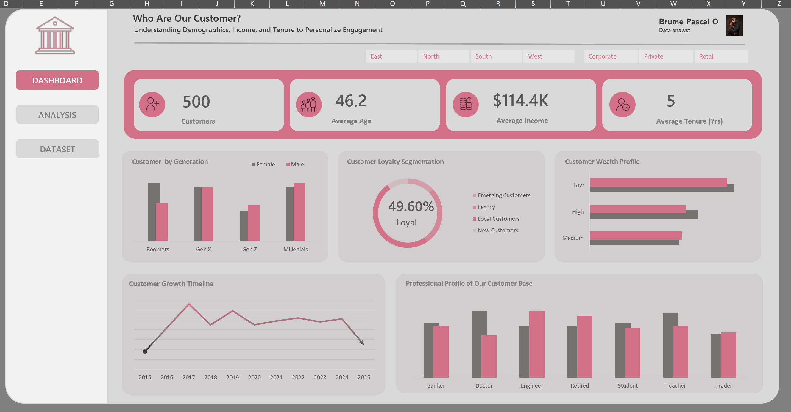

# Customer Segmentation Dashboard Using Excel

This project demonstrates how Microsoft Excel can be used to segment customers and extract meaningful insights using demographic, income and tenure-based groupings. The dashboard allows stakeholders to understand who their customers are, how long they have stayed with the company and their spending potential. The goal is to support more personalized engagement and improve strategic decision making.

---

## 🎯 Project Objective

To build an interactive Excel dashboard that segments customers into meaningful groups using:

- **Generation (Age)**
- **Income Bracket (Wealth Profile)**
- **Tenure Group (Loyalty)**
- **Occupation Profile**

The analysis enables business teams to easily identify high value and long term customers, and align marketing and retention strategies accordingly.

---

## 📁 Dataset Summary

| Attribute               | Description                                                              |
|------------------------|---------------------------------------------------------------------------|
| Customer ID            | Unique identifier                                                        |
| Age                    | Used to derive customer generation                                       |
| Income                 | Annual income, used for wealth profile                                   |
| Tenure (Years)         | Number of years the customer has stayed                                  |
| Gender                 | Used for demographic distribution                                        |
| Occupation             | Provides professional segmentation                                      |
| Region                 | Used for filtering segmentation                                          |

Total Customers: **500**

---

## 🛠 Tools and Techniques

- **Excel** (Dashboarding, Pivot Tables, Slicers, Advanced Formulas)
- **IF Statements and Nested Logic** for segmentation
- **Charts Used:** Column, Bar, Donut, Line Charts
- **Dynamic Filters:** Region and Customer Type

### Formulas Used for Segmentation

```excel
-- Generation
=IF(Age<=28,"Gen Z",IF(Age<=44,"Millennials",IF(Age<=60,"Gen X","Boomers")))

-- Wealth Profile
=IF(Income<=100000,"Low",IF(Income<=300000,"Medium",
   IF(Income<=700000,"High","Premium")))

-- Tenure Group
=IF(Tenure<1,"New",IF(Tenure<3,"Emerging",
   IF(Tenure<7,"Loyal","Legacy")))
```

## 🔍 Key Segmentation Logic

| Segmentation Type | Group | Criteria |
|------------------|--------|----------|
| Generation | Boomers, Gen X, Millennials, Gen Z | Based on customer age |
| Wealth Profile | Low, Medium, High, Premium | Derived from income field |
| Loyalty Level | New, Emerging, Loyal, Legacy | Based on customer tenure |
| Occupation | Banker, Doctor, Engineer, Teacher, Trader, etc | Based on profession |

---

## 📊 Dashboard Overview



### Key Metrics

- **500** total customers  
- **46.2** average age  
- **$114.4K** average annual income  
- **5 years** average tenure  
- **49.6%** identified as loyal customers  

---

## 📈 Insights

### 🔹 Customer Distribution by Generation
- Millennials and Gen X customers make up most of the customer base  
- Boomers contribute lower numbers but higher tenure  

### 🔹 Loyalty Segmentation
- Nearly **50%** of customers are loyal, which suggests good long term retention  
- Very few new customers, indicating low acquisition  

### 🔹 Wealth Profile
- Majority of customers fall within **Low to Medium** income brackets  
- High income customers exist but represent a smaller group and may be high value targets  

### 🔹 Customer Growth Timeline
- Growth peaked in **2017**  
- Decline observed from **2024 to 2025**, indicating a need for stronger customer acquisition strategy  

### 🔹 Profession-Based Segmentation
- Teachers and Engineers make up the most consistent segment  
- Bankers and Doctors represent fewer numbers but higher income potential  

---

## 📌 Business Recommendations

- Prioritize **Millennial and Gen X** customers in future marketing campaigns  
- Develop exclusive plans for **high income** customers  
- Improve acquisition methods targeting **new customers**  
- Explore reactivation strategies to reverse recent customer decline  
- Create retention programs to convert **Emerging** customers into **Loyal**  

---

## 👨🏾‍💻 Author

**Brume Pascal Opitien**  
Data Analyst  


🔗 **GitHub:** https://github.com/bopitien  
🔗 **LinkedIn:** https://www.linkedin.com/in/pascalbrume  
🔗 **Portfolio:** https://pascalbrume-portfolio.lovable.app/

##credit

Freedom Oboh
Data Visualization expert
www.youtube.com/@ObohYT

